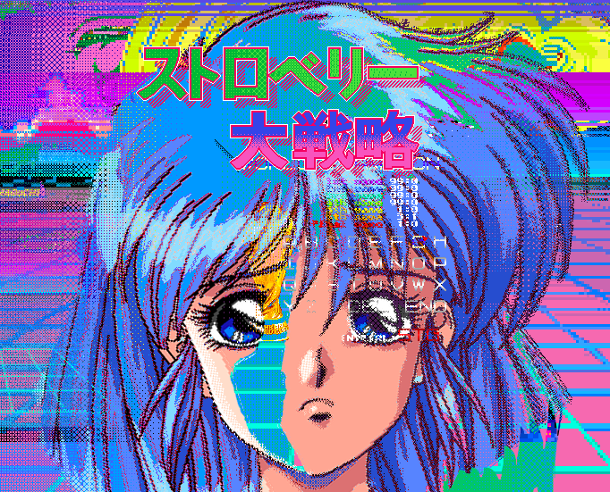

   &nbsp;&nbsp;
&nbsp;&nbsp;
&nbsp;&nbsp;
&nbsp;&nbsp;
&nbsp;&nbsp;
 

<h3> |🤖 Trishul Nayak |  💻 Full Stack Developer |🛸 Odisha, India</h3>

- 🎓 1st yr MCA at [RIMS,Rourkela,Odisha.](http://www.rimsedu.org/) <code>Graduation: 2023</code>
- 🥀 Learning Vue.js<code></code>next.js<code></code>

  - <i>with Javascript<code></code>, Express<code></code>, React<code></code>, Node<code></code> and 69 others.</img>👨‍💻
  - 🌱 learning **Data Structures and Algorithms.**

- 🦾Machine Learning and Deep Learning.<code></code>

  <!-- - 🧠 Spending time with my models 🤖 -->

- A new decentralized internet on its way🧠.
- 👯 I’m looking to collaborate on **OpenSource Projects**
- Cyber Security.
- UI/UX Design .<code></code>

- 💼 any freelance work? do reach, [gmail 📧](mailto:@gmail.com)
- 💬 ask me anything, I am happy to help 🤗

**languages and tools:**

- Web: <code></code>
  <code></code>
  <code></code>
  <code></code>
  <code></code>
  <code></code>
  <code></code>
  <code></code>
  <code></code>
  <!-- <code></code> -->

- Machine Learning:<code></code> <code></code>
  <code></code>
  <code></code>
  <code></code>
  <code></code>

- Other: <code></code>
  <code></code>
  <code></code>
  <code></code>

 
    
    
     
     
     
     
     
     
     
    
     
     
       
     
     
    
    

    
 

## Connect with me:

